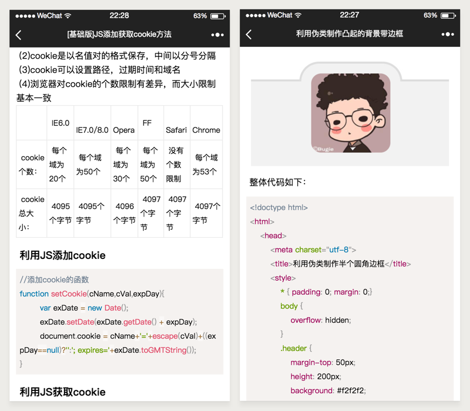

## 微信小程序富文本解析 - richTextParse。
将请求到的HTML代码转化为[rich-text标签](https://mp.weixin.qq.com/debug/wxadoc/dev/component/rich-text.html)中nodes属性支持的JSON格式，从而实现在微信小程序中的可视化。因为是根据我自己的需求去做的，所以目前功能比较简单。

在此推荐“[wxParse](https://github.com/icindy/wxParse)”组件，功能比较全。但因为wxParse解析pre标签有点问题，所以才动手写了richTextParse。

richTextParse的思路就是将HTML代码解析为DOM树型结构，非常好理解。你也可以在目前代码的基础上进行更多的标签验证（目前我只验证了图像标签，在图像标签中加入src等属性），丰富代码功能。而这一切都不能离开微信小程序中的[rich-text标签](https://mp.weixin.qq.com/debug/wxadoc/dev/component/rich-text.html)支持。

### 效果


支持Html文档中常用的标签。

### 使用
需要使用到的文件有两个：“richText.js”和“richText.wxss”。它们存放在：“utils/richTextParse”文件夹下。

在合适的位置引入样式，例如“app.wxss”(建议)，或者在需要使用的位置，它的“*.wxss”中。

而这个功能我只有一处用到，所以直接在需要使用的位置引入JS文件即可。
#### 引入文件
```
//在使用的View(pages/article/index.js)中引入
var richTextParse = require('../../utils/richTextParse/richText.js');
```
```
//在“app.wxss”中引入
@import 'utils/richTextParse/richText.wxss';
```
在接口获取html的位置，使用“richTextParse.go()”方法获取到解析的结果。例如我的：
#### 解析html代码
```
success:function(rs){
  that.setData({
    ...
    bodyHtml: richTextParse.go(rs.data.body),
    ...
  })
}
```
#### 模板中使用
而在wxml中使用rice-text即可：
```
<rich-text nodes='{{bodyHtml}}'></rich-text>
```
------
另外如果你有多处需要用到这一功能，建议把JS在“app.js”中引入，并且挂在App下：
```
var richTextParse = require('utils/richTextParse/richText.js');
App({
    ...
    richTextParse : richTextParse.go,
    ...
})
```
在需要使用的位置使用全局richTextParse方法即可：
```
var app = getApp();
Page({
    ......
             bodyHtml: app.richTextParse(rs.data.body),
    ......
})
```

### 结尾
基本功能可以使用，因为已经满足我自己的需求了，所以应该不会常更新。而如果小伙伴在使用的时候想要有什么功能的话希望可以给我提优化的意见~